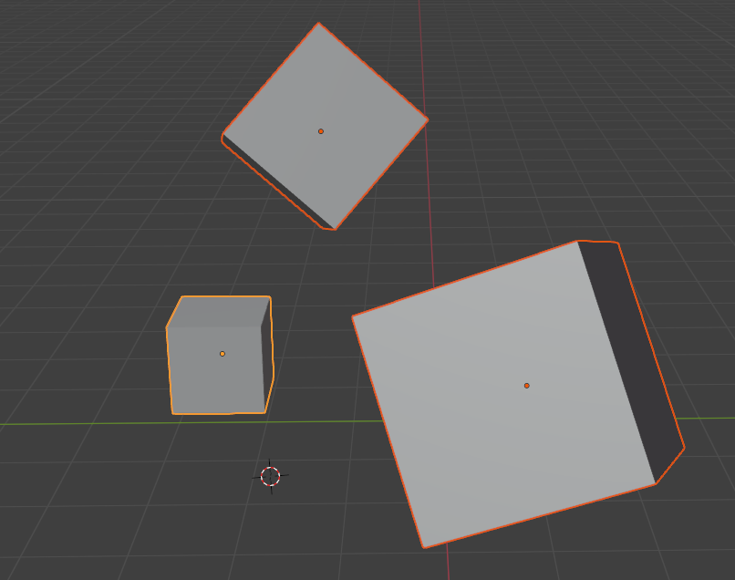
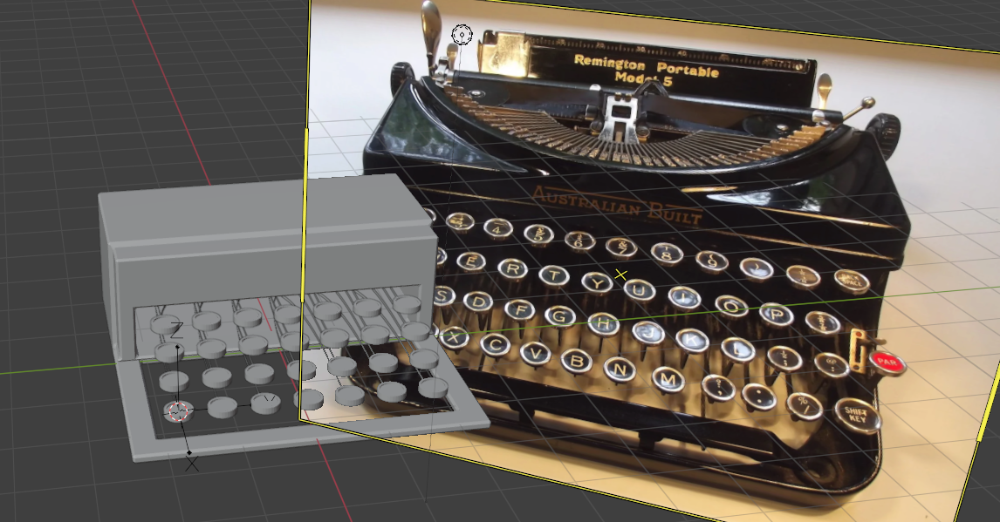

# Weekly Creative Coding Challenges 2025 - Week 12 - 'Typewriter Art'
## Final Live Code

## Final Result - Video
<!--  -->

## WCCChallenge Blurb
| Biz             | Biz Biz                                 |
|-----------      |---------------------------------------|
| Author          | Project Somedays                      |
| Title           | WCCChallenge 2025 Week 12 - Morph with Quadtree |
| 📅 Started      | 2025-03-23, updated 2025-03-29        |
| 📅 Completed    | 2025-03-23, updated 2025-03-30        |
| 🕒 Taken 🕒    | ?        |
| 🤯 Concept  | Exploded views are neat        |
| 🔎 Focus 🔍     | Manipulating GLTF Scenes. Might actually be handy for work RE documentation/instructions for constructing and maintaining STEM equipment        |

Made for Sableraph's weekly creative coding challenges, reviewed weekly on https://www.twitch.tv/sableraph
See other submissions here: https://openprocessing.org/curation/78544
Join The Birb's Nest Discord community! https://discord.gg/g5J6Ajx9Am

## Resources:

## Stretch Goals/Extension Ideas
- [ ] Swirl the parts around artistically with open simplex noise

## TODO:
- [x] Test simple setup
- [x] Write modelWrangler class
- [x] Import simplex-noise
- [x] Reading and storing positional data from the scene for each model
- [x] Mutiply position vectors to get
- [x] Lerp between initial and target 
- [x] Easing function
- [x] Cool swirly motion for whole group
- [x] getNoiseVal function
- [] Test the code still works for my typewriter mockup model

## Things I've learned
- OBJ doesn't store the initial positional data
- THREE.js is SO much more complex than p5js. Which I already knew, but I've worked in p5 for so long, I'd forgotten how many niceties is has. Like handling mouse presses etc.

## 🪵Dev Log🪵
### 2025-03-30 Finishing touches
### 2025-03-29 Threejs exploded view
  - Test: export a simple scene from Blender
    - Store initial positions
    - Calculate target positions
    - Do a cool swirly and lerp between exploded and assembled states
  
  - Realise after a couple of hours that OBJ exports don't embed positional data
  - Switch to GLTF
  - Get that working for really simple models
  - Struggle to get it working for more complex models imported from BlenderKit
  - Begin work on making my own in Blender
  