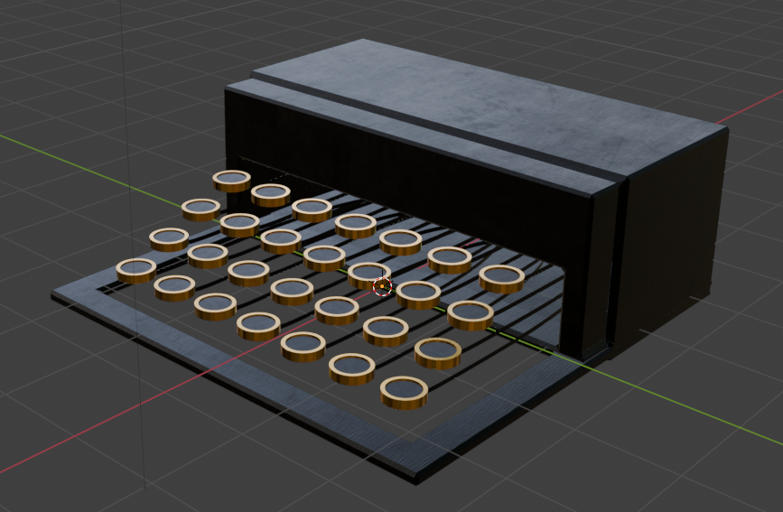
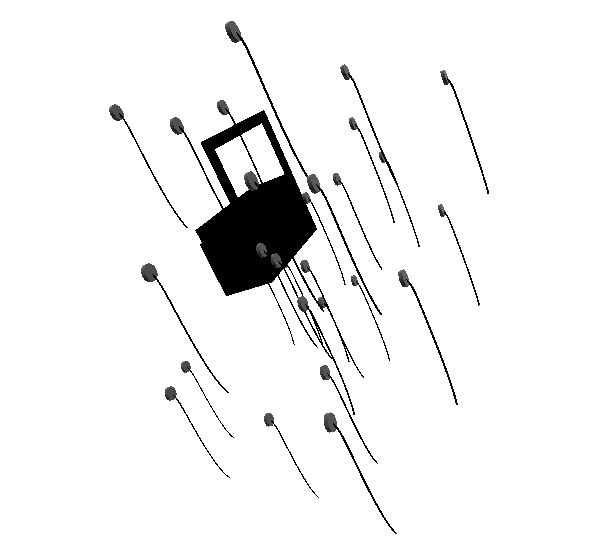

# Weekly Creative Coding Challenges 2025 - Week 13 - 'Typewriter Art'
## Final Live Code
<iframe src="https://openprocessing.org/sketch/2596343/embed/?plusEmbedHash=898e24b8&userID=410675&plusEmbedTitle=true&show=sketch" width="400" height="400"></iframe>

## Final Result - Video
<!--  -->

## WCCChallenge Blurb

| Biz             | Biz Biz                               |
|:---             | :---                                  |
| Author          | Project Somedays                      |
| Title           | WCCChallenge 2025 Week 12 - Morph with Quadtree |
| 📅 Started      | 2025-03-23, updated 2025-03-29        |
| 📅 Completed    | 2025-03-23, updated 2025-03-30        |
| 🕒 Taken 🕒    | 6hrs        |
| 🤯 Concept     | Exploded views are neat        |
| 🔎 Focus 🔍    | Manipulating GLTF Scenes. Might actually be handy for work RE documentation/instructions for constructing and maintaining STEM equipment        |

Made for Sableraph's weekly creative coding challenges, reviewed weekly on https://www.twitch.tv/sableraph
See other submissions here: https://openprocessing.org/curation/78544
Join The Birb's Nest Discord community! https://discord.gg/g5J6Ajx9Am

## Resources:
- "Typewriter" by Metro on Sketchfab: [https://sketchfab.com/3d-models/typewriter-c212b517cbdd4fa1930ed31a45670d39](https://sketchfab.com/3d-models/typewriter-c212b517cbdd4fa1930ed31a45670d39)

## Stretch Goals/Extension Ideas
- [ ] Swirl the parts around artistically with open simplex noise
- [ ] Look at a bunch of different machines that would be cool to explode
- [ ] Explode extent controls

## TODO:
- [x] Test simple setup
- [x] Write modelWrangler class
- [x] Import simplex-noise
- [x] Reading and storing positional data from the scene for each model
- [x] Mutiply position vectors to get
- [x] Lerp between initial and target 
- [x] Easing function
- [x] Cool swirly motion for whole group
- [x] getNoiseVal function
- [x] Test the code still works for my typewriter mockup model
- [x] Set targets to random
- [x] Fix weird error that turned out to be a mistaken export thing
- [x] Ooft wrap some of it in p5js so it works in OpenProcessing
- [x] lil-gui biz

## Things I've learned
- OBJ doesn't store the initial positional data
- THREE.js is SO much more complex than p5js. Which I already knew, but I've worked in p5 for so long, I'd forgotten how many niceties is has. Like handling mouse presses etc.

## 🪵Dev Log🪵

### 2025-03-29 Threejs exploded view
  - Test: export a simple scene from Blender
    - Store initial positions
    - Calculate target positions
    - Do a cool swirly and lerp between exploded and assembled states
  
  
  
  - Realise after a couple of hours that OBJ exports don't embed positional data
  - Switch to GLTF
  - Get that working for really simple models
  - Struggle to get it working for more complex models imported from BlenderKit
  - Easing functions are fun
  - Begin work on making my own in Blender
  
  

  ### 2025-03-30 The Deadline approaches

   - Quick tests with applying transforms or resetting... not quite what I'm after
   - Hooray! Generating random targets works great and is close enough to what I'm after
  
  
  

  - Get it to run in openProcessing --> involved declaring my initial setup in p5js setup. Good to know!
